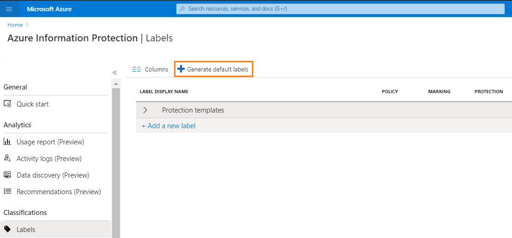
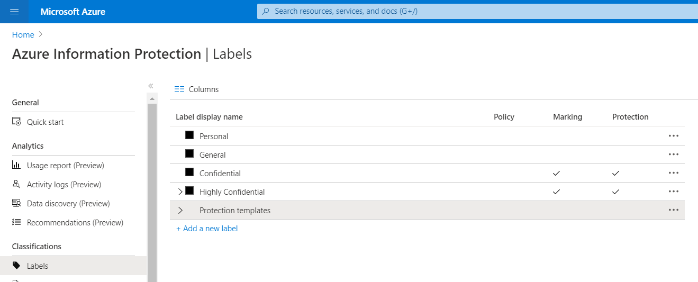

# Quickstart: Get started with Azure Information Protection in the Azure portal

>*Applies to: [Azure Information Protection](https://azure.microsoft.com/pricing/details/information-protection)*

In this quickstart, you'll add Azure Information Protection to the Azure portal, confirm the protection service is activated, create default labels if you don't already have labels, and view the policy settings for the Azure Information Protection client (classic).

You can finish this quickstart in less than 10 minutes.

## Prerequisites

To complete this quickstart, you need:

- A subscription that includes Azure Information Protection Plan 1 or Plan 2.
    
    If you don't have one of these subscriptions, you can create a [free](https://admin.microsoft.com/Signup/Signup.aspx?OfferId=87dd2714-d452-48a0-a809-d2f58c4f68b7) account for your organization.

For a full list of prerequisites to use Azure Information Protection, see [Requirements for Azure Information Protection](requirements.md).

## Add Azure Information Protection to the Azure portal

Azure Information Protection isn't automatically available in the Azure portal. You must add it.

1. Sign in to the [Azure portal](https://portal.azure.com) by using the global admin account for your tenant. 
    
    If you are not the global admin, use the following link for alternative roles: [Signing in to the Azure portal](configure-policy.md#signing-in-to-the-azure-portal)

2. On the hub menu, select **Create a resource**, and then, from the search box for the Marketplace, type **Azure Information Protection**. 
    
3. From the results list, select **Azure Information Protection**. Then on the **Azure Information Protection** blade, click **Create**.
    
    > [!TIP] 
    > Optionally, select **Pin to dashboard** to create an **Azure Information Protection** tile on your dashboard, so that you can skip browsing to the service the next time you sign in to the portal.
    
    Click **Create** again.

## Confirm the protection service is activated

The protection service is now automatically activated for new customers, but it's a good idea to confirm it doesn't need manually activating. 

1. On the **Azure Information Protection** blade, select **Manage** > **Protection activation**.

2. Confirm whether protection is activated for your tenant: 
    
    - If protection is activated, you see the following confirmation:
        
        
        
    - If protection is not activated, you see this reflected in the status information, and the option to activate:
        
        

3. If protection isn't activated, select **Activate**. 

    When activation is complete, the information bar displays **Activation finished successfully**.

## Create labels - if necessary

Your organization might already have labels because they were automatically created for your tenant, or because you have sensitivity labels in the Office 365 Security & Compliance center, the Microsoft security center, or the Microsoft compliance center. Let's take a look:

1. Select **Classifications** > **Labels**:
    
    If you see the option **Generate default labels**, you don't yet have any labels:
    
     
    
    If you don't see this option to generate default labels, you already have labels, probably similar to those in the following picture, which are the default labels for Azure Information Protection:
    
    

2. If you do have labels, go to the next section to view your labels. If you don't yet have labels, select that option to **Generate default labels**.

4. Then, to publish the labels for all users, from **Classifications** > **Policies** > **Global**:
    
    a. Select **Add or remove labels**.
    
    b. From the **Policy: Add or remove labels** blade, select all the labels, and then select **OK**.
    
    c. Back on the **Policy: Global blade**, select **Save**.

## View your labels

Select **Classifications** > **Labels**, and spend a few minutes familiarizing yourself with the labels that are displayed on the **Azure Information Protection - Labels** blade.

If they don't look similar to the labels in the picture from the previous section, you aren't using default labels from Azure Information Protection but labels that have been created from the Office 365 Security & Compliance Center, the Microsoft 365 Security center, or the Microsoft 365 Compliance center.

> [!TIP]
> If you don't want to use your custom labels, but instead, use default labels from Azure Information Protection: 
> - Delete the custom labels and you then see the option to generate default labels in the **Labels** blade, as described in the [previous section](#create-labels---if-necessary). 

From the **Azure Information Protection - Labels** blade:

- The default labels for classification are **Personal**, **Public**, **General**, **Confidential**, and **Highly Confidential**. The last two labels expand to show sublabels, which provide examples of how a classification can have subcategories.

- From the **MARKING** and **PROTECTION** columns, you can see that some labels have visual markings configured. The visual markers are a footer, header, and watermark. Some labels might also have protection set. 

For example: 

If you select a label, you see details for that label configuration on a new blade.

## View your policy settings

The first time you connect to the Azure Information Protection service by using the Azure portal, default policy settings are always created for you that are used by the Azure Information Protection client (classic). For the classic client, policy settings and the labels we viewed are downloaded to the client in the Azure Information Protection policy.

If you are using the Azure Information Protection unified labeling client, this client does not use these policy settings. Instead, this client downloads labels and policy settings from the Office 365 Compliance & Security Center, the Microsoft 365 Compliance center, or the Microsoft 365 Security center. Use those admin centers to view the equivalent label policies instead of the Azure portal.

To view the default Azure Information Protection policy settings for the classic client:

1. Select **Classifications** > **Policies** > **Global** to display the default Azure Information Protection policy settings that are created for your tenant.
    
2. After the labels, in the **Configure settings to display and apply on Information Protection end users** section, you see the policy settings. For example, there is no default label set, documents and emails are not required to have a label, and users do not have to provide justification when they change labels:
    
    

3. Because you are only viewing the settings, you can close any blades in the portal that you have opened.

## Next steps

If you are using the classic client:

- You might find the following tutorial helpful as your next step: [Edit the policy and create a new label for Azure Information Protection](infoprotect-quick-start-tutorial.md).
- Alternatively, for detailed instructions for configuring all aspects of the Azure Information Protection policy, see [Configuring the Azure Information Protection policy](configure-policy.md).

If you are using the unified labeling client:

- See [Overview of sensitivity labels](/microsoft-365/compliance/sensitivity-labels) from the Office documentation.

Not sure of the difference between these clients? See this [FAQ](faqs.md#whats-the-difference-between-the-azure-information-protection-client-and-the-azure-information-protection-unified-labeling-client).
