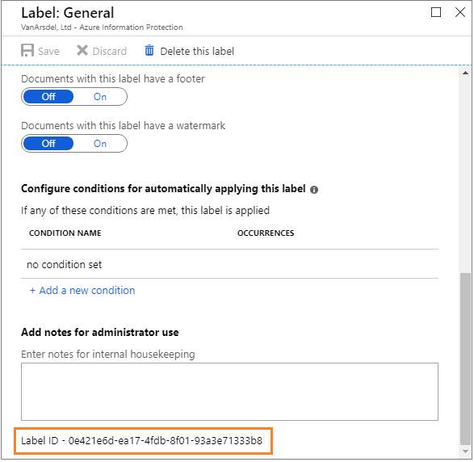
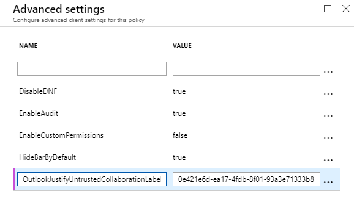
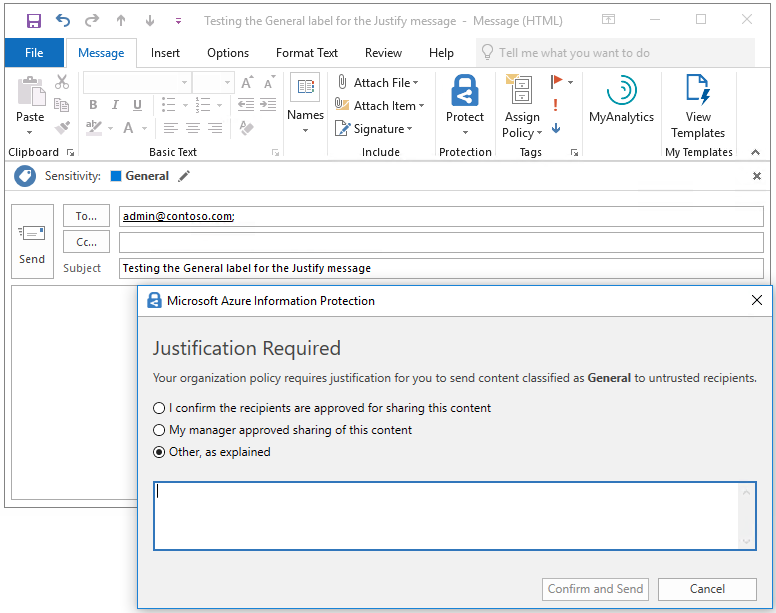
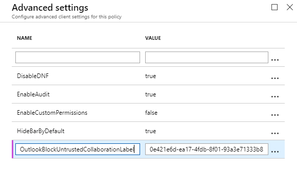
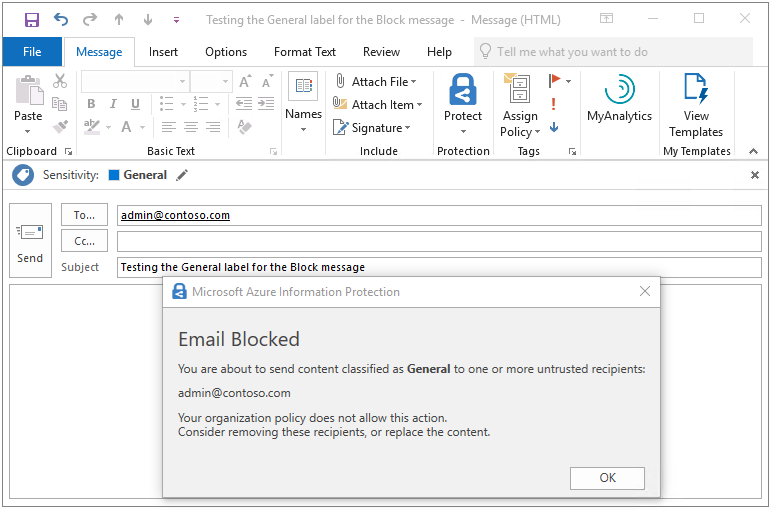
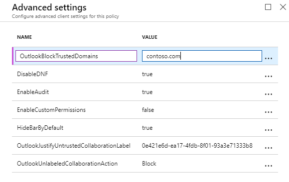
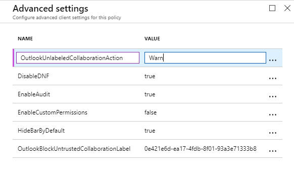
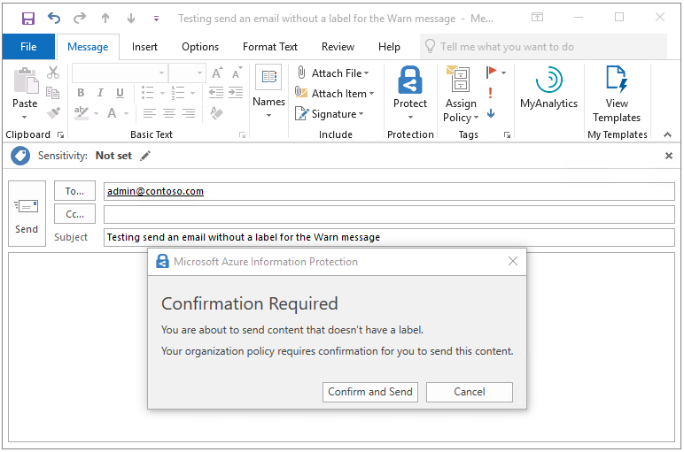
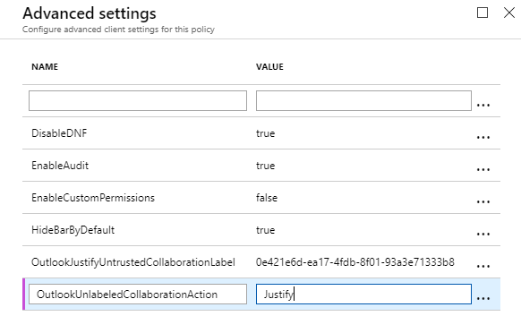
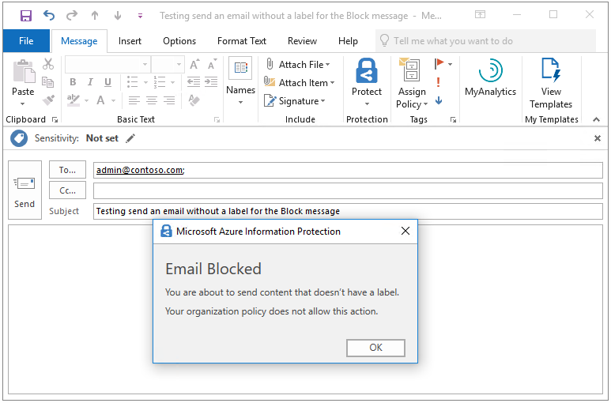

---
# required metadata

title: Tutorial - Preventing oversharing using Azure Information Protection (AIP)
description: A detailed tutorial for using the Azure Information Protection (AIP) client to prevent users from oversharing your content.
author: batamig
ms.author: bagol
manager: rkarlin
ms.date: 08/04/2020
ms.topic: tutorial
ms.collection: M365-security-compliance
ms.service: information-protection

# optional metadata

#ROBOTS:
#audience:
#ms.devlang:
ms.subservice: aiplabels
#ms.reviewer: eymanor
#ms.suite: ems
#ms.tgt_pltfrm:
ms.custom: admin

---

- Implement pop-up messages in Outlook that warn, justify, or block emails being sent
https://docs.microsoft.com/en-us/azure/information-protection/infoprotect-oversharing-tutorial
https://docs.microsoft.com/en-us/azure/information-protection/rms-client/clientv2-admin-guide-customizations#implement-pop-up-messages-in-outlook-that-warn-justify-or-block-emails-being-sent
PDF for creditsuisse adding for Q3

# Tutorial: Preventing oversharing using Azure Information Protection (AIP)

>*Applies to: [Azure Information Protection](https://azure.microsoft.com/pricing/details/information-protection)*
>
> *Instructions for: [Azure Information Protection client for Windows](faqs.md#whats-the-difference-between-the-azure-information-protection-classic-and-unified-labeling-clients)*

System administrators must ensure that their organization's content remains secure, and is shared only with trusted users. Preventing oversharing can include limiting internal access to specific users only, or sharing content only with trusted external users.

One of the most comment methods that users share content inappropriately is email, either in the email itself or as an attachment. Use this tutorial to learn how to use implement popup messages in Outlook that:

- Block sensitive content from being emailed to untrusted users
- Warn users about sensitive content they may be sending
- Request that users justify the content they are sending to untrusted users

**Time required:** You can complete this tutorial in less than 15 minutes.

## Tutorial prerequisites

To complete this tutorial, you'll need to have the Azure Information Protection unified labeling client installed on your machine. For more information see, [Tutorial: Deploying the Azure Information Protection (AIP) unified labeling client](tutorial-deploy-client.md).

Additionally, you'll need:

|Prerequisites  |Description  |
|---------|---------|
|**Azure Information Protection subscription**     |   A [subscription](https://admin.microsoft.com/Signup/Signup.aspx?OfferId=87dd2714-d452-48a0-a809-d2f58c4f68b7) that includes Azure Information Protection Plan 2.      |
|**Access to the Azure portal**     |    Access to the [Azure portal](https://portal.azure.com), using one of the following administrator accounts:      |
|**Sensitivity labels**     |  At least one label configured in your policy. Sensitivity labels are configured in your labeling management center, including the Office 365 Security & Compliance Center, Microsoft 365 Security center, or Microsoft 365 Compliance Center.  </br></br>Make sure that you have the name of your policy handy, as well as the GUIDs for any specific labels you want to use for your popup messages.    |
|**Machine requirements**     |  A computer running Windows, minimum version Windows 7, Service Pack 1. </br>Make sure that PowerShell is installed, and that you have the ability to run PowerShell as an administrator. </br></br>Additionally, make sure you can sign into Outlook. Be prepared to restarted Outlook multiple times during this tutorial.     |
| | |

Let's get started. 


## Add default warning, justification, and blocking popup messages to Outlook for emails being sent with sensitive content

- Admin guide instructions: [Implement pop-up messages in Outlook that warn, justify, or block emails being sent](./rms-client/clientv2-admin-guide-customizations.md#implement-pop-up-messages-in-outlook-that-warn-justify-or-block-emails-being-sent)

## Implement pop-up messages in Outlook that warn, justify, or block emails being sent

This configuration uses policy [advanced settings](#how-to-configure-advanced-settings-for-the-client-by-using-office-365-security--compliance-center-powershell) that you must configure by using Office 365 Security & Compliance Center PowerShell.

When you create and configure the following advanced client settings, users see pop-up messages in Outlook that can warn them before sending an email, or ask them to provide justification why they are sending an email, or prevent them from sending an email for either of the following scenarios:

- **Their email or attachment for the email has a specific label**:
    - The attachment can be any file type

- **Their email or attachment for the email doesn't have a label**:
    - The attachment can be an Office document or PDF document

When these conditions are met, the user sees a pop-up message with one of the following actions:

- **Warn**: The user can confirm and send, or cancel.

- **Justify**: The user is prompted for justification (predefined options or free-form).  The user can then send or cancel the email. The justification text is written to the email x-header, so that it can be read by other systems. For example, data loss prevention (DLP) services.

- **Block**: The user is prevented from sending the email while the condition remains. The message includes the reason for blocking the email, so the user can address the problem. For example, remove specific recipients, or label the email. 

When the popup-messages are for a specific label, you can configure exceptions for recipients by domain name.

> [!TIP]
> See the video [Azure Information Protection Outlook Popup Configuration](https://azure.microsoft.com/resources/videos/how-to-configure-azure-information-protection-popup-for-outlook/) for a walkthrough example of how to configure these settings.

## Show a warning, justification, or warning popup message for specific labels

This procedure supports a use case scenario where users send emails, or emails with attachments, that have a specific label. Configure a warning, justification, or blocking message to appear in Outlook, depending on the label detected.

1. Run PowerShell as an administrator. 

1. Run the **Set-LabelPolicy** cmdlet to define AIP advanced settings, using the following syntax:
    
    ```PowerShell
    Set-LabelPolicy -Identity Global -AdvancedSettings @{<Key>="<Value>"}
    ```

    Where:

    - <Key> is one of the following:
        - **OutlookWarnUntrustedCollaborationLabel** to set a warning popup
        - **OutlookJustifyUntrustedCollaborationLabel** to set a justification popup
        - **OutlookBlockUntrustedCollaborationLabel** to block the email and set a blocking popup
        
    - <Value> is at least one label GUID. Separate multiple GUIDs by commas to apply the same popup to multiple labels

    For example:

    ```PowerShell
    Set-LabelPolicy -Identity Global -AdvancedSettings @{OutlookWarnUntrustedCollaborationLabel="8faca7b8-8d20-48a3-8ea2-0f96310a848e,b6d21387-5d34-4dc8-90ae-049453cec5cf,bb48a6cb-44a8-49c3-9102-2d2b017dcead,74591a94-1e0e-4b5d-b947-62b70fc0f53a,6c375a97-2b9b-4ccd-9c5b-e24e4fd67f73"}

    Set-LabelPolicy -Identity Global -AdvancedSettings @{OutlookJustifyUntrustedCollaborationLabel="dc284177-b2ac-4c96-8d78-e3e1e960318f,d8bb73c3-399d-41c2-a08a-6f0642766e31,750e87d4-0e91-4367-be44-c9c24c9103b4,32133e19-ccbd-4ff1-9254-3a6464bf89fd,74348570-5f32-4df9-8a6b-e6259b74085b,3e8d34df-e004-45b5-ae3d-efdc4731df24"}

    Set-LabelPolicy -Identity Global -AdvancedSettings @{OutlookBlockUntrustedCollaborationLabel="0eb351a6-0c2d-4c1d-a5f6-caa80c9bdeec,40e82af6-5dad-45ea-9c6a-6fe6d4f1626b"}
    ```

## Prevent popups from being displayed for trusted domains

Prevent your popups from being displayed when an email is sent to users in trusted domains, such as your own organization's domain, or your partners. 

1. Run PowerShell as an administrator.

1. Run the **Set-LabelPolicy** cmdlet to define AIP advanced settings, using the following syntax:
    
    ```PowerShell
    Set-LabelPolicy -Identity Global -AdvancedSettings @{<Key>="<Value>"}
    ```

    Where:

    - <Key> is one of the following:
        - **OutlookWarnTrustedDomains** to define trusted domains for warning messages
        - **OutlookJustifyTrustedDomains** to define trusted domains for justification messages
        - **OutlookBlockTrustedDomains** to define trusted domains for blocked emails
            
    - <Value> is at least one label GUID. Separate multiple GUIDs by commas to apply the same popup to multiple labels

    For example:

    ```PowerShell
    Set-LabelPolicy -Identity Global -AdvancedSettings @{OutlookWarnUntrustedCollaborationLabel="8faca7b8-8d20-48a3-8ea2-0f96310a848e,b6d21387-5d34-4dc8-90ae-049453cec5cf,bb48a6cb-44a8-49c3-9102-2d2b017dcead,74591a94-1e0e-4b5d-b947-62b70fc0f53a,6c375a97-2b9b-4ccd-9c5b-e24e4fd67f73"}

    Set-LabelPolicy -Identity Global -AdvancedSettings @{OutlookJustifyUntrustedCollaborationLabel="dc284177-b2ac-4c96-8d78-e3e1e960318f,d8bb73c3-399d-41c2-a08a-6f0642766e31,750e87d4-0e91-4367-be44-c9c24c9103b4,32133e19-ccbd-4ff1-9254-3a6464bf89fd,74348570-5f32-4df9-8a6b-e6259b74085b,3e8d34df-e004-45b5-ae3d-efdc4731df24"}

    Set-LabelPolicy -Identity Global -AdvancedSettings @{OutlookBlockUntrustedCollaborationLabel="0eb351a6-0c2d-4c1d-a5f6-caa80c9bdeec,40e82af6-5dad-45ea-9c6a-6fe6d4f1626b"}
    ```
    
#### To exempt domain names for pop-up messages configured for specific labels

For the labels that you've specified with these pop-up messages, you can exempt specific domain names so that users do not see the messages for recipients who have that domain name included in their email address. In this case, the emails are sent without interruption. To specify multiple domains, add them as a single string, separated by commas.

A typical configuration is to display the pop-up messages only for recipients who are external to your organization or who aren't authorized partners for your organization. In this case, you specify all the email domains that are used by your organization and by your partners.

For the same label policy, create the following advanced client settings and for the value, specify one or more domains, each one separated by a comma.

Example value for multiple domains as a comma-separated string: `contoso.com,fabrikam.com,litware.com`

- Warn messages:
    
    - Key: **OutlookWarnTrustedDomains**
    
    - Value: **\<**domain names, comma separated**>**

- Justification messages:
    
    - Key: **OutlookJustifyTrustedDomains**
    
    - Value: **\<**domain names, comma separated**>**

- Block messages:
    
    - Key: **OutlookBlockTrustedDomains**
    
    - Value: **\<**domain names, comma separated**>**

For example, you have specified the **OutlookBlockUntrustedCollaborationLabel** advanced client setting for the **Confidential \ All Employees** label. You now specify the additional advanced client setting of **OutlookJustifyTrustedDomains** and **contoso.com**. As a result, a user can send an email to john@sales.contoso.com when it is labeled **Confidential \ All Employees** but will be blocked from sending an email with the same label to a Gmail account.

Example PowerShell commands, where your label policy is named "Global":

```PowerShell
Set-LabelPolicy -Identity Global -AdvancedSettings @{OutlookBlockTrustedDomains="gmail.com"}

Set-LabelPolicy -Identity Global -AdvancedSettings @{OutlookJustifyTrustedDomains="contoso.com,fabrikam.com,litware.com"}
```

### To implement the warn, justify, or block pop-up messages for emails or attachments that don't have a label:

For the same label policy, create the following advanced client setting with one of the following values:

- Warn messages:
    
    - Key: **OutlookUnlabeledCollaborationAction**
    
    - Value: **Warn**

- Justification messages:
    
    - Key: **OutlookUnlabeledCollaborationAction**
    
    - Value: **Justify**

- Block messages:
    
    - Key: **OutlookUnlabeledCollaborationAction**
    
    - Value: **Block**

- Turn off these messages:
    
    - Key: **OutlookUnlabeledCollaborationAction**
    
    - Value: **Off**


Example PowerShell command, where your label policy is named "Global":

```PowerShell
Set-LabelPolicy -Identity Global -AdvancedSettings @{OutlookUnlabeledCollaborationAction="Warn"}
```

#### To define specific file name extensions for the warn, justify, or block pop-up messages for email attachments that don't have a label

By default, the warn, justify, or block pop-up messages apply to all Office documents and PDF documents. You can refine this list by specifying which file name extensions should display the warn, justify, or block messages with an additional advanced setting and a comma-separated list of file name extensions.

Example value for multiple file name extensions to define as a comma-separated string: `.XLSX,.XLSM,.XLS,.XLTX,.XLTM,.DOCX,.DOCM,.DOC,.DOCX,.DOCM,.PPTX,.PPTM,.PPT,.PPTX,.PPTM`

In this example, an unlabeled PDF document will not result in warn, justify, or block pop-up messages.

For the same label policy, enter the following strings: 


- Key: **OutlookOverrideUnlabeledCollaborationExtensions**

- Value: **\<**file name extensions to display messages, comma separated**>**


Example PowerShell command, where your label policy is named "Global":

```PowerShell
Set-LabelPolicy -Identity Global -AdvancedSettings @{OutlookOverrideUnlabeledCollaborationExtensions=".PPTX,.PPTM,.PPT,.PPTX,.PPTM"}
```

#### To specify a different action for email messages without attachments

By default, the value that you specify for OutlookUnlabeledCollaborationAction to warn, justify, or block pop-up messages applies to emails or attachments that don't have a label. You can refine this configuration by specifying another advanced setting for email messages that don't have attachments.

Create the following advanced client setting with one of the following values:

- Warn messages:
    
    - Key: **OutlookUnlabeledCollaborationActionOverrideMailBodyBehavior**
    
    - Value: **Warn**

- Justification messages:
    
    - Key: **OutlookUnlabeledCollaborationActionOverrideMailBodyBehavior**
    
    - Value: **Justify**

- Block messages:
    
    - Key: **OutlookUnlabeledCollaborationActionOverrideMailBodyBehavior**
    
    - Value: **Block**

- Turn off these messages:
    
    - Key: **OutlookUnlabeledCollaborationActionOverrideMailBodyBehavior**
    
    - Value: **Off**

If you don't specify this client setting, the value that you specify for OutlookUnlabeledCollaborationAction is used for unlabeled email messages without attachments as well as unlabeled email messages with attachments.

Example PowerShell command, where your label policy is named "Global":

```PowerShell
Set-LabelPolicy -Identity Global -AdvancedSettings @{OutlookUnlabeledCollaborationActionOverrideMailBodyBehavior="Warn"}
```


## Identify a label ID for testing

For this tutorial, we'll use just one label to see the resulting behavior for users. You can use any label, but a good example for testing is the default label named **General**, which is typically suitable for business data that is not intended for public consumption, and does not apply protection.

To specify your chosen label, you must know its ID, which you identify from the Azure portal:

1. Open a new browser window and sign in to the [Azure portal](https://portal.azure.com) as a global admin. Then navigate to **Azure Information Protection**. 
    
    For example, in the search box for resources, services, and docs: Start typing **Information** and select **Azure Information Protection**.
    
    If you are not the global admin, use the following link for alternative roles: [Signing in to the Azure portal](configure-policy.md#signing-in-to-the-azure-portal)

2. Select **Classifications** > **Labels** and then select the **General** label to open the **Label: General** pane. 

3. Locate the label ID at the bottom of the pane:
    
    

4. Copy and paste the label ID value into a temporary file so that this value can be easily copied for a later step. In our example, this label ID value is **0e421e6d-ea17-4fdb-8f01-93a3e71333b8**.

5. Close the **Label: General** pane, but do not close the Azure portal.

## Create a scoped policy to test the new advanced client settings

We'll create a new scoped policy so that the new advanced client settings will apply to just you, for testing.

1. On the **Azure Information Protection - Policies** pane, select **Add a new policy**. You then see the **Policy** pane that displays labels and settings from your existing global policy.

2. Specify the policy name of **Oversharing tutorial** and optionally, a description of **Advanced client settings to control oversharing using Outlook**.

3. Select **Specify which users/groups get this policy**, and using the subsequent panes, specify your own user account.

4. With your account name now displayed on the **Policy** pane, select **Save** without making additional changes to the labels or settings on this pane. You might be prompted to confirm your choice. 

This scoped policy is now ready to add advanced client settings. Close the **Policy: Oversharing tutorial** pane, but do not close the Azure portal.

## Configure and test advanced client settings to warn, prompt for justification, or block emails that have the General label

For this step of the tutorial, we'll specify the following advanced client settings, and test each in turn:

- **OutlookWarnUntrustedCollaborationLabel**
- **OutlookJustifyUntrustedCollaborationLabel**
- **OutlookBlockUntrustedCollaborationLabel**

### Create the advanced client setting to warn users if an email or attachment has the General label

Using the newly created scoped policy, we'll add a new advanced client setting named **OutlookWarnUntrustedCollaborationLabel** with the ID of your **General** label: 

1. Back on the **Azure Information Protection - Policies** pane, select the context menu (**...**) next to **Oversharing tutorial**. Then select **Advanced settings**.

2. On the **Advanced settings** pane, type the advanced setting name, **OutlookWarnUntrustedCollaborationLabel**, and paste your own label ID for the value. Using our example label ID:
    
    
    

3. Select **Save and close**.

Do not close the **Policies** pane, or the Azure portal.

### Test the advanced client setting to warn users if an email or attachment has the General label

On your client computer, we'll now see the results of configuring this advanced client setting.

1. On your client computer, open Outlook. 
    
    If Outlook is already open, restart it. The restart is needed to download the change we just made.

2. Create a new email message, and apply the **General** label. For example, from the **File** tab, select the **Protect** button, and then select **General**.

3. Specify your own email address for the **To** field, and for the subject, type **Testing the General label for the Warn message**. Then send the email.

4. As a result of the advanced client setting, you see the following warning, asking you to confirm before sending the email. For example:
    
    
    
5. As if you are a user who has mistakenly tried to email something that was labeled **General**, select **Cancel**. You see that the email is not sent but the email message remains so you can make changes, such as change the content or the label.

6. Without making any changes, select **Send** again. This time, as if you are a user who acknowledges that the content is appropriate for sending, select **Confirm and Send**. The email is sent.

### Change the advanced client setting to prompt users to justify if an email has the General label

We'll edit the existing advanced client setting to keep your **General** label ID, but change the name to **OutlookJustifyUntrustedCollaborationLabel**: 

1. On the **Azure Information Protection - Policies** pane, select the context menu (**...**) next to **Oversharing tutorial**. Then select **Advanced settings**.

2. On the **Advanced settings** pane, replace the previous advanced setting name you created, **OutlookWarnUntrustedCollaborationLabel**, with the new name of **OutlookJustifyUntrustedCollaborationLabel**:
    
    

3. Select **Save and close**.

Do not close the **Policies** pane, or the Azure portal.

### Test the advanced client setting to prompt users to justify if an email has the General label

On your client computer, we'll now see the results of this new advanced client setting.

1. On your client computer, restart Outlook to download the change we just made.

2. Create a new email message, and as before, apply the **General** label. For example, from the **File** tab, select the **Protect** button, and then select **General**.

3. Specify your own email address for the **To** field, and for the subject, type **Testing the General label for the Justify message**. Then send the email.

4. This time, you see the following message, asking you to provide justification before sending the email. For example:
    
    
    
5. As if you are a user who has mistakenly tried to email something that was labeled as **General**, select **Cancel**. You see that the email is not sent but the email message itself remains so you can make changes, such as change the content or the label.

6. Without making any changes, select **Send** again. This time, select one of the justification options, such as **I confirm the recipients are approved for sharing this content**, and then select **Confirm and Send**. The email is sent.

### Change the advanced client setting to block users from sending an email that has the General label

We'll edit the existing advanced client setting one more time, to keep your **General** label ID, but change the name to **OutlookBlockUntrustedCollaborationLabel**: 

1. In the Azure portal, on the **Azure Information Protection - Policies** pane, select the context menu (**...**) next to **Oversharing tutorial**. Then select **Advanced settings**.

2. On the **Advanced settings** pane, replace the previous advanced setting name you created, **OutlookJustifyUntrustedCollaborationLabel**, with the new name of **OutlookBlockUntrustedCollaborationLabel**:
    
    

3. Select **Save and close**.

Do not close the **Policies** pane, or the Azure portal.

### Test the advanced client setting to block users from sending an email that has the General label

On your client computer, we'll now see the results of this new advanced client setting.

1. On your client computer, restart Outlook to download the change we just made.

2. Create a new email message, and as before, apply the **General** label. For example, from the **File** tab, select the **Protect** button, and then select **General**.

3. Specify your own email address for the **To** field, and for the subject, type **Testing the General label for the Block message**. Then send the email.

4. This time, you see the following message that prevents the email from being sent. For example:
    
    

5. Acting as your user, you see the only option available is **OK**, which takes you back to the email message where you can make changes. Select **OK**, and cancel this email message.

### Use Event Log to identify the messages and user actions for the General label

Before we move on to the next scenario for when an email or attachment doesn't have a label, start Event Viewer and navigate to **Applications and Services Logs** > **Azure Information Protection**.

For each of the tests that you did, information events are created to record both the message and the user response:

- Warn messages: Information ID 301

- Justify messages: Information ID 302

- Block messages: Information ID 303

For example, the first test was to warn the user, and you selected **Cancel**, so the **User Response** displays **Dismissed** in the first Event 301. For example:

```
Client Version: 1.53.10.0
Client Policy ID: e5287fe6-f82c-447e-bf44-6fa8ff146ef4
Item Full Path: Testing the General label for the Warn message.msg
Item Name: Testing the General label for the Warn message
Process Name: OUTLOOK
Action: Warn
Label After Action: General
Label ID After Action: 0e421e6d-ea17-4fdb-8f01-93a3e71333b8
Action Source: 
User Response: Dismissed
```

However, you then selected **Confirm and Send**, which is reflected in the next Event 301, where the **User Response** displays **Confirmed**:

```
Client Version: 1.53.10.0
Client Policy ID: e5287fe6-f82c-447e-bf44-6fa8ff146ef4
Item Full Path: Testing the General label for the Warn message.msg
Item Name: Testing the General label for the Warn message
Process Name: OUTLOOK
Action: Warn
Label After Action: General
Label ID After Action: 0e421e6d-ea17-4fdb-8f01-93a3e71333b8
Action Source: 
User Response: Confirmed
```

The same pattern is repeated for the justify message, which has an Event 302. The first event has a **User Response** of **Dismissed**, and the second shows the justification that was selected. For example:

```
Client Version: 1.53.10.0
Client Policy ID: e5287fe6-f82c-447e-bf44-6fa8ff146ef4
Item Full Path: Testing the General label for the Justify message.msg
Item Name: Testing the General label for the Justify message
Process Name: OUTLOOK
Action: Justify
Label After Action: General
Label ID After Action: 0e421e6d-ea17-4fdb-8f01-93a3e71333b8
User Justification: I confirm the recipients are approved for sharing this content
Action Source: 
User Response: Confirmed

```

At the top of the event log, you see the block message logged, which has an Event 303. For example:

```
Client Version: 1.53.10.0
Client Policy ID: e5287fe6-f82c-447e-bf44-6fa8ff146ef4
Item Full Path: Testing the General label for the Block message.msg
Item Name: Testing the General label for the Block message
Process Name: OUTLOOK
Action: Block
Label After Action: General
Label ID After Action: 0e421e6d-ea17-4fdb-8f01-93a3e71333b8
Action Source: 
```

### Optional: Create an additional advanced client setting to exempt these messages for internal recipients

You tested your warn, justify, and block messages by using your own email address as the recipient. In a production environment, you might choose to display these messages for your specified labels only if recipients are external to your organization. You might extend that exemption to partners that your organization regularly works with.

To illustrate how this works, we'll create an additional advanced client setting named **OutlookBlockTrustedDomains** and specify your own domain name from your email address. This will prevent the block message you saw previously from displaying for recipients that share your domain name in their email address, but will still be shown for other recipients. You can similarly create additional advanced client settings for **OutlookWarnTrustedDomains** and **OutlookJustifyTrustedDomains**.

1. In the Azure portal, on the **Azure Information Protection - Policies** pane, select the context menu (**...**) next to **Oversharing tutorial**. Then select **Advanced settings**.

2. On the **Advanced settings** pane, type the advanced setting name, **OutlookBlockTrustedDomains**, and paste your domain name from your email address for the value. For example:
    
    

4. Select **Save and close**. Do not close the **Policies** pane, or the Azure portal.

5. Now repeat the [previous test to block users from sending an email that has the General label](#test-the-advanced-client-setting-to-block-users-from-sending-an-email-that-has-the-general-label), and you no longer see the block message when you use your own email address. The email is sent without interruption.
    
    To confirm that the block message is still shown for external recipients, repeat the test one more time but specify a recipient from outside your organization. This time, you see the block message again, listing the new recipient address as untrusted.

## Configure and test an advanced client setting to warn, prompt for justification, or block emails that don't have a label

For this step of the tutorial, we'll specify a new advanced client setting with different values, and test each in turn:

- **OutlookUnlabeledCollaborationAction**

### Create the advanced client setting to warn users if an email doesn't have a label

This new advanced client setting named **OutlookUnlabeledCollaborationAction** doesn't need a label ID but specifies the action to take for unlabeled content: 

1. In the Azure portal, back on the **Azure Information Protection - Policies** pane, select the context menu (**...**) next to **Oversharing tutorial**. Then select **Advanced settings**.

2. On the **Advanced settings** pane, type the advanced setting name, **OutlookUnlabeledCollaborationAction**, and for the value, specify **Warn**:
    
    

3. Select **Save and close**.

Do not close the **Policies** pane, or the Azure portal.

### Test the advanced client setting to warn users if an email doesn't have a label

On your client computer, we'll now see the results of configuring this new advanced client setting for when content doesn't have a label:

1. On your client computer, restart Outlook to download the change we just made.

2. Create a new email message, and this time, do not apply a label.

3. Specify your own email address for the **To** field, and for the subject, type **Testing send an email without a label for the Warn message**. Then send the email.

4. This time, you see a **Confirmation Required** message that you can **Confirm and Send** or **Cancel**:
    
    

5. Select **Confirm and Send**.

### Change the advanced client setting to prompt users to justify if an email is unlabeled

We'll edit the existing advanced client setting to keep the name of **OutlookUnlabeledCollaborationAction**, but change the value to **Justify**: 

1. On the **Azure Information Protection - Policies** pane, select the context menu (**...**) next to **Oversharing tutorial**. Then select **Advanced settings**.

2. On the **Advanced settings** pane, locate the **OutlookUnlabeledCollaborationAction** setting and replace the previous value of **Warn** with new value **Justify**:
    
    

3. Select **Save and close**.

Do not close the **Policies** pane, or the Azure portal.

### Test the advanced client setting to prompt users to justify if an email isn't labeled

On your client computer, we'll now see the results of changing the value for this advanced client setting.

1. On your client computer, restart Outlook to download the change we just made.

2. Create a new email message, and as before, do not apply a label.

3. Specify your own email address for the **To** field, and for the subject, type **Testing send an email without a label for the Justify message**. Then send the email.

4. This time, you see a **Justification Required** message with different options:
    
    

5. Select an option, such as **My manager approved sharing of this content**. Then select **Confirm and Send**.

### Change the advanced client setting to block users from sending an email that isn't labeled

As before, we'll edit the existing advanced client setting to keep the name of **OutlookUnlabeledCollaborationAction**, but change the value to **Block**: 

1. On the **Azure Information Protection - Policies** pane, select the context menu (**...**) next to **Oversharing tutorial**. Then select **Advanced settings**.

2. On the **Advanced settings** pane, locate the **OutlookUnlabeledCollaborationAction** setting and replace the previous value of **Justify** with the new value of **Block**:
    
    

3. Select **Save and close**.

Do not close the **Policies** pane, or the Azure portal.

### Test the advanced client setting to block users from sending an email that isn't labeled

On your client computer, we'll now see the results of changing the value of this advanced client setting.

1. On your client computer, restart Outlook to download the change we just made.

2. Create a new email message, and as before, do not apply a label.

3. Specify your own email address for the **To** field, and for the subject, type **Testing send an email without a label for the Block message**. Then send the email.

4. This time, you see the following message that prevents the email from being sent, with an explanation for the user. For example:
    
    

5. Acting as your user, you see the only option available is **OK**, which takes you back to the email message where you can select a label.
    
    Select **OK**, and cancel this email message.

### Use Event Log to identify the messages and user actions for the unlabeled email

As before, the messages and user responses are logged in Event Viewer, **Applications and Services Logs** > **Azure Information Protection**, with the same event IDs.

- Warn messages: Information ID 301

- Justify messages: Information ID 302

- Block messages: Information ID 303

For example, the results of our justification prompt when the email didn't have a label:

```
Client Version: 1.53.10.0
Client Policy ID: e5287fe6-f82c-447e-bf44-6fa8ff146ef4
Item Full Path: Testing send an email without a label for the Justify message.msg
Item Name: Testing send an email without a label for the Justify message
Process Name: OUTLOOK
Action: Justify
User Justification: My manager approved sharing of this content
Action Source: 
User Response: Confirmed
```

## Clean up resources

Do the following if you don't want to keep the changes that you made in this tutorial:

1. In the Azure portal, on the **Azure Information Protection - Policies** pane, select the context menu (**...**) next to **Oversharing tutorial**. Then select **Delete policy**.

2. If you are prompted to confirm, select **OK**.

Restart Outlook so it's no longer configured for the settings we configured for this tutorial.

## Next steps

For quicker testing, this tutorial used an email message to a single recipient, and without attachments. But you can apply the same method with multiple recipients, multiple labels, and also apply the same logic to email attachments whose labeling status is often less obvious to users. For example, the email message itself is labeled Public but the PowerPoint presentation attached is labeled General. For more information about the configuration options, see the following section from the admin guide: [Implement pop-up messages in Outlook that warn, justify, or block emails being sent](./rms-client/client-admin-guide-customizations.md#implement-pop-up-messages-in-outlook-that-warn-justify-or-block-emails-being-sent)

The admin guide also contains information about other advanced client settings that you can use to customize the behavior of the client. For a full list, see [Available advanced client settings](./rms-client/client-admin-guide-customizations.md#available-advanced-client-settings).


## Next steps

