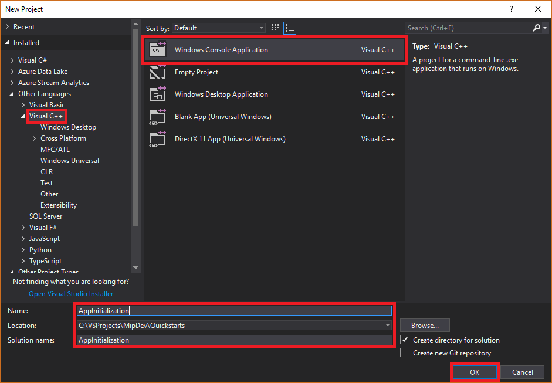
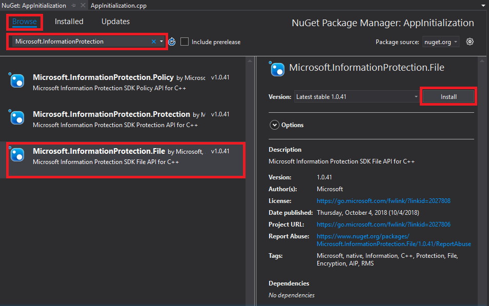
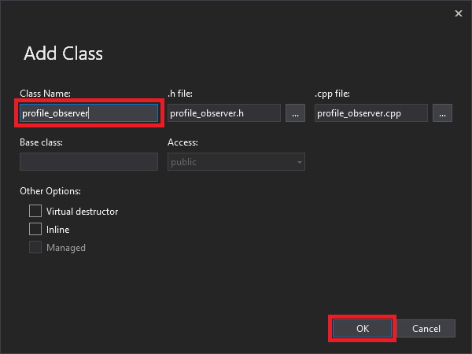

# Quickstart: Client application initialization (C++)

This quickstart will show you how to implement the client initialization pattern, used by the MIP C++ SDK at runtime. 

> [!NOTE]
> The steps outlined in this quickstart are required for any client application that uses the MIP File, Policy, or Protection APIs. Although this Quickstart demonstrates usage of the File APIs, this same pattern is applicable to clients using the Policy and Protection APIs. Future Quickstarts should be done serially, as each one builds on the previous one, with this one being the first.

## Prerequisites

If you haven't already, be sure to:

- Complete the steps in [Microsoft Information Protection (MIP) SDK setup and configuration](setup-configure-mip.md). This "Client application initialization" Quickstart relies on proper SDK setup and configuration.
- Optionally:
  - Review [Profile and engine objects](concept-profile-engine-cpp.md). The profile and engine objects are universal concepts, required by clients that use the MIP File/Policy/Protection APIs. 
  - Review [Authentication concepts](concept-authentication-cpp.md) to learn how authentication and consent are implemented by the SDK and client application.
  - Review [Observer concepts](concept-async-observers.md) to learn more about observers, and how they're implemented. The MIP SDK makes use of the observer pattern to implement asynchronous event notifications.

## Create a Visual Studio solution and project

First we create and configure the initial Visual Studio solution and project, upon which the other Quickstarts will build. 

1. Open Visual Studio 2017, select the **File** menu, **New**, **Project**. In the **New Project** dialog:
   - In the left pane, under **Installed**, **Other Languages**, select **Visual C++**.
   - In the center pane, select **Windows Console Application**
   - In the bottom pane, update the project **Name**, **Location**, and the containing **Solution name** accordingly.
   - When finished, click the **OK** button in the lower right.

     [](media/quick-app-initialization-cpp/create-vs-solution.png#lightbox)

2. Add the Nuget package for the MIP SDK File API to your project:
   - In the **Solution Explorer**, right click on the project node (directly under the top/solution node), and select **Manage NuGet packages...**:
   - When the **NuGet Package Manager** tab opens in the Editor Group tabs area:
     - Select **Browse**.
     - Enter "Microsoft.InformationProtection" in the search box.
     - Select the "Microsoft.InformationProtection.File" package.
     - Click "Install", then click "OK" when the **Preview changes** confirmation dialog displays.
   
     [](media/quick-app-initialization-cpp/add-nuget-package.png#lightbox)
 
## Implement an observer class to monitor the File profile and engine objects

Now create a basic implementation for a File profile observer class, by extending the SDK's `mip::FileProfile::Observer` class. The observer is instantiated and used later, to monitor the loading of the File profile object, and adding the engine object to the profile.

1. Add a new class to your project, which generates both the header/.h and implementation/.cpp files for you:

   - In the **Solution Explorer**, right click on the project node again, select **Add**, then select **Class**.
   - On the **Add Class** dialog:
     - In the **Class Name** field, enter "profile_observer". Notice that both the **.h file** and **.cpp file** fields are automatically populated, based on the name you enter.
     - When finished, click the **OK** button.

     [](media/quick-app-initialization-cpp/add-class.png#lightbox)

2. After generating the .h and .cpp files for the class, both files are opened in Editor Group tabs. Now update each file to implement your new observer class:

   - Update "profile_observer.h", by selecting/deleting the generated `profile_observer` class. **Don't** remove the preprocessor directives generated by the previous step (#pragma, #include). Then copy/paste the following source into the file, after any existing preprocessor directives:

     ```cpp
     #include <memory>
     #include "mip/file/file_profile.h"

     class ProfileObserver final : public mip::FileProfile::Observer {
     public:
          ProfileObserver() { }
          void OnLoadSuccess(const std::shared_ptr<mip::FileProfile>& profile, const std::shared_ptr<void>& context) override;
          void OnLoadFailure(const std::exception_ptr& error, const std::shared_ptr<void>& context) override;
          void OnAddEngineSuccess(const std::shared_ptr<mip::FileEngine>& engine, const std::shared_ptr<void>& context) override;
          void OnAddEngineFailure(const std::exception_ptr& error, const std::shared_ptr<void>& context) override;
     };
     ```

   - Update "profile_observer.cpp", by selecting/deleting the generated `profile_observer` class implementation. **Don't** remove the preprocessor directives generated by the previous step (#pragma, #include). Then copy/paste the following source into the file, after any existing preprocessor directives:

     ```cpp
     #include <future>

     using std::promise;
     using std::shared_ptr;
     using std::static_pointer_cast;
     using mip::FileEngine;
     using mip::FileProfile;

     void ProfileObserver::OnLoadSuccess(const shared_ptr<FileProfile>& profile, const shared_ptr<void>& context) {
          auto promise = static_pointer_cast<std::promise<shared_ptr<FileProfile>>>(context);
          promise->set_value(profile);
     }

     void ProfileObserver::OnLoadFailure(const std::exception_ptr& error, const shared_ptr<void>& context) {
          auto promise = static_pointer_cast<std::promise<shared_ptr<FileProfile>>>(context);
          promise->set_exception(error);
     }

     void ProfileObserver::OnAddEngineSuccess(const shared_ptr<FileEngine>& engine, const shared_ptr<void>& context) {
          auto promise = static_pointer_cast<std::promise<shared_ptr<FileEngine>>>(context);
          promise->set_value(engine);
     }

     void ProfileObserver::OnAddEngineFailure(const std::exception_ptr& error, const shared_ptr<void>& context) {
          auto promise = static_pointer_cast<std::promise<shared_ptr<FileEngine>>>(context);
          promise->set_exception(error);
     }
     ```

3. Optionally, use F6 (**Build Solution**) to run a test compile/link of your solution, to make sure it builds successfully before continuing.

## Implement an authentication delegate

The MIP SDK implements authentication using class extensibility, which provides a mechanism to share authentication work with the client application. The client must acquire a suitable OAuth2 access token, and provide to the MIP SDK at runtime. 

Now create an implementation for an authentication delegate, by extending the SDK's `mip::AuthDelegate` class, and overriding/implementing the `mip::AuthDelegate::AcquireOAuth2Token()` pure virtual function. The authentication delegate is instantiated and used later, by the File profile and File engine objects.

1. Using the same Visual Studio "Add Class" feature we used in step #1 of the previous section, add another class to your project. This time, enter "auth_delegate" in the **Class Name** field. 

2. Now update each file to implement your new authentication delegate class:

   - Update "auth_delegate.h", by replacing all of the generated `auth_delegate` class code with the following source. **Don't** remove the preprocessor directives generated by the previous step (#pragma, #include):

     ```cpp
     #include <string>
     #include "mip/common_types.h"

     class AuthDelegateImpl final : public mip::AuthDelegate {
     public:
          AuthDelegateImpl() = delete;        // Prevents default constructor
          
          AuthDelegateImpl(
            const std::string& appId)         // AppID for registered AAD app
            : mAppId(appId) {};

          bool AcquireOAuth2Token(            // Called by MIP SDK to get a token
            const mip::Identity& identity,    // Identity of the account to be authenticated, if known
            const OAuth2Challenge& challenge, // Authority (AAD tenant issuing token), and resource (API being accessed; "aud" claim).
            OAuth2Token& token) override;     // Token handed back to MIP SDK
     private:
          std::string mAppId;
          std::string mToken;
          std::string mAuthority;
          std::string mResource;
     };
     ```

   - Update "auth_delegate.cpp", by replacing all of the generated `auth_delegate` class implementation with the following source. **Don't** remove the preprocessor directives generated by the previous step (#pragma, #include). 

     > [!IMPORTANT]
     > The following token acquisition code is not suitable for production use. In production, this must be replaced by code that dynamically acquires a token, using:
     > - The appId and reply/redirect URI specified in your Azure AD app registration (reply/redirect URI **must** match your app registration)
     > - The authority and resource URL passed by the SDK in the `challenge` argument (resource URL **must** match your app registration's API/permissions)
     > - Valid app/user credentials, where the account matches the `identity` argument passed by the SDK. OAuth2 "native" clients should prompt for user credentials and use the "authorization code" flow. OAuth2 "confidential clients" can use their own secure credentials with the "client credentials" flow (such as a service), or prompt for user credentials using the "authorization code" flow (such as a web app). 
     >
     > OAuth2 token acquisition is a complex protocol, and normally accomplished by using a library. TokenAcquireOAuth2Token() is called **only** by the MIP SDK, as required.

     ```cpp
     #include <iostream>
     using std::cout;
     using std::cin;
     using std::string;

     bool AuthDelegateImpl::AcquireOAuth2Token(const mip::Identity& identity, const OAuth2Challenge& challenge, OAuth2Token& token) 
     {
          // Acquire a token manually, reuse previous token if same authority/resource. In production, replace with token acquisition code.
          string authority = challenge.GetAuthority();
          string resource = challenge.GetResource();
          if (mToken == "" || (authority != mAuthority || resource != mResource))
          {
              cout << "\nRun the PowerShell script to generate an access token using the following values, then copy/paste it below:\n";
              cout << "Set $authority to: " + authority + "\n";
              cout << "Set $resourceUrl to: " + resource + "\n";
              cout << "Sign in with user account: " + identity.GetEmail() + "\n";
              cout << "Enter access token: ";
              cin >> mToken;
              mAuthority = authority;
              mResource = resource;
              system("pause");
          }

          // Pass access token back to MIP SDK
          token.SetAccessToken(mToken);

          // True = successful token acquisition; False = failure
          return true;
     }
     ``` 
3. Optionally, use F6 (**Build Solution**) to run a test compile/link of your solution, to make sure it builds successfully before continuing.

## Implement a consent delegate

Now create an implementation for a consent delegate, by extending the SDK's `mip::ConsentDelegate` class, and overriding/implementing the `mip::AuthDelegate::GetUserConsent()` pure virtual function. The consent delegate is instantiated and used later, by the File profile and File engine objects.

1. Using the same Visual Studio "Add Class" feature we used previously, add another class to your project. This time, enter "consent_delegate" in the **Class Name** field. 

2. Now update each file to implement your new consent delegate class:

   - Update "consent_delegate.h", by replacing all of the generated `consent_delegate` class code with the following source. **Don't** remove the preprocessor directives generated by the previous step (#pragma, #include):

     ```cpp
     #include "mip/common_types.h"
     #include <string>

     class ConsentDelegateImpl final : public mip::ConsentDelegate {
     public:
          ConsentDelegateImpl() = default;
          virtual mip::Consent GetUserConsent(const std::string& url) override;
     };
     ```

   - Update "consent_delegate.cpp", by replacing all of the generated `consent_delegate` class implementation with the following source. **Don't** remove the preprocessor directives generated by the previous step (#pragma, #include). 

     ```cpp
     #include <iostream>
     using mip::Consent;
     using std::string;

     Consent ConsentDelegateImpl::GetUserConsent(const string& url) 
     {
          // Accept the consent to connect to the url
          std::cout << "SDK will connect to: " << url << std::endl;
          return Consent::AcceptAlways;
     }
     ``` 
3. Optionally, use F6 (**Build Solution**) to run a test compile/link of your solution, to make sure it builds successfully before continuing.

## Construct a File profile and engine

As mentioned, profile and engine object are required for SDK clients using MIP APIs. Complete the coding portion of this Quickstart, by adding code to instantiate the profile and engine objects: 

1. From **Solution Explorer**, open the .cpp file in your project that contains the implementation of the `main()` method. It defaults to the same name as the project containing it, which you specified during project creation.

2. Remove the generated implementation of `main()`. **Don't** remove preprocessor directives generated by Visual Studio during project creation (#pragma, #include). Append the following code after any preprocessor directives:

   ```cpp
   #include "auth_delegate.h"
   #include "consent_delegate.h"
   #include "profile_observer.h"

   using std::promise;
   using std::future;
   using std::make_shared;
   using std::shared_ptr;
   using std::string;
   using std::cout;
   using mip::ApplicationInfo; 
   using mip::FileProfile;
   using mip::FileEngine;

   int main()
   {
     // Construct/initialize objects required by the application's profile object
     ApplicationInfo appInfo{"<application-id>",                    // ApplicationInfo object (App ID, name, version)
                 "<application-name>",
                 "<application-version>"};
     auto profileObserver = make_shared<ProfileObserver>();         // Observer object					
     auto authDelegateImpl = make_shared<AuthDelegateImpl>(         // Authentication delegate object (App ID)
                 "<application-id>");
     auto consentDelegateImpl = make_shared<ConsentDelegateImpl>(); // Consent delegate object
 
     // Construct/initialize profile object
     FileProfile::Settings profileSettings("",    // Path for logging/telemetry/state
       true,                                      // true = use in-memory state storage (vs disk)
       authDelegateImpl,							
       consentDelegateImpl,						
       profileObserver,							
       appInfo);									

     // Set up promise/future connection for async profile operations; load profile asynchronously
     auto profilePromise = make_shared<promise<shared_ptr<FileProfile>>>();
     auto profileFuture = profilePromise->get_future();
	try
	{ 
		mip::FileProfile::LoadAsync(profileSettings, profilePromise);
	}
	catch (const std::exception& e)
	{
		cout << "An exception occurred... are the Settings and ApplicationInfo objects populated correctly?\n\n"
			<< e.what() << "'\n";
		system("pause");
		return 1;

	}
	auto profile = profileFuture.get();

     // Construct/initialize engine object
     FileEngine::Settings engineSettings(
       mip::Identity("<engine-account>"),         // Engine identity (account used for authentication)
       "<engine-state>",                          // User-defined engine state		
       "en-US");                                  // Locale (default = en-US)

     // Set up promise/future connection for async engine operations; add engine to profile asynchronously
     auto enginePromise = make_shared<promise<shared_ptr<FileEngine>>>();
     auto engineFuture = enginePromise->get_future();
     profile->AddEngineAsync(engineSettings, enginePromise);
     std::shared_ptr<FileEngine> engine; 
     try
     {
       engine = engineFuture.get();				
     }
     catch (const std::exception& e)
     {
       cout << "An exception occurred... is the access token incorrect/expired?\n\n"
        << e.what() << "'\n";
       system("pause");
       return 1;
     }

   return 0;
   }
   ``` 

3. Replace the placeholder values in the source code that you just pasted in, using the following values:

   | Placeholder | Value | Example |
   |:----------- |:----- |:--------|
   | \<application-id\> | The Azure AD Application ID (GUID) assigned to the application registered in [step #2 of the "MIP SDK setup and configuration"](/information-protection/develop/setup-configure-mip#register-a-client-application-with-azure-active-directory) article. Replace 2 instances.  | "0edbblll-8773-44de-b87c-b8c6276d41eb" |
   | \<application-name\> | A user-defined friendly name for your application. Must contain valid ASCII characters (excluding ';'), and ideally matches the application name you used in your Azure AD registration. | AppInitialization |
   | \<application-version\> | User-defined version info for your application. Must contain valid ASCII characters (excluding ';'). | 1.1.0.0 |
   | \<engine-account\> | The account used for the engine's identity. When you authenticate with a user account during token acquisition, it must match this value. | user1@tenant.onmicrosoft.com |
   | \<engine-state\> | User-defined state to be associated with the engine. | MyAppState |


4. Now do a final build of the application and resolve any errors. Your code should build successfully, but will not yet run correctly until you complete the next Quickstart. If you run the application, you will see output similar to the following. You won't have an access token to provide, until you complete the next Quickstart.

   ```console
   Run the PowerShell script to generate an access token using the following values, then copy/paste it below:
   Set $authority to: https://login.windows.net/common/oauth2/authorize
   Set $resourceUrl to: https://syncservice.o365syncservice.com/
   Sign in with user account:
   Enter access token:
   ```

## Next Steps

Now that your initialization code is complete, you're ready for the next quickstart, where you'll start to experience the MIP File APIs.

> [!div class="nextstepaction"]
> [List sensitivity labels](quick-file-list-labels-cpp.md)
